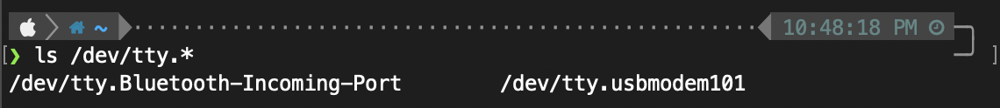

# Purpose
My bedroom is consistently the hottest and coldest room in my home, depending on the time of year. My bedroom has a south-facing balcony; this is good for winters (for me) and bad for summers. I keep most of my plants in my bedroom, to hide them from my cat. I wanted to see what the temperature and humidity were in my bedroom versus the rest of my home (compared to the thermostat) to see how I could better improve my sleeping conditions and the environment for my plants.

# Hardware
#### Particle Photon (Headers) | WRL-13774 - https://www.sparkfun.com/products/13774
#### SparkFun Photon Weather Shield | DEV-13630 - https://www.sparkfun.com/products/retired/13630
I was given this Photon Weather Shield, and found out afterwards that it is the retired version. The retired version has the HTU21D humidity and MPL3115A2 barometric pressure sensors. If you're looking at [tutorials online](https://learn.sparkfun.com/tutorials/photon-weather-shield-hookup-guide-v11), make sure you're using [ones that are for the HTU21D sensor](https://learn.sparkfun.com/tutorials/photon-weather-shield-hookup-guide/all).<br>
<br>

| HTU21D sensor (old)<br> | Si7021 sensor (current)<br> |
| --- | --- |

#### Power Source
For power, I used a spare micro USB cable with an old Chromecast power brick. Seems to work fine, so far.

# Method
I have very little experience in coding or technical projects. I can and have soldered because of my mechanical keyboard hobby, and I spent many hours dabbling in HTML and CSS in my youth customizing my xanga, myspace, tumblr. Working on this was eye-opening, and it took me a little more than half the day to get it working and to a good stopping point.

#### Getting Ready

I made an account on [Particle](https://www.particle.io/) to register my device and set up wifi on it. There are several ways to make an account and register your device(s): web browser, mobile app, command line. (I did web browser and found out about the other methods afterwards.) I used [Particle Build](https://build.particle.io/build/new), which is their online IDE, to do this. This is also where I verified my code and flashed the Photon later on. There are tons of libraries you can add to your app, and the [Particle docs](https://docs.particle.io/) are a helpful resource. (Maybe too helpful because it's a lot of information to absorb as a first-timer.)

#### Program Device

OK, so you've made an account and registered your device. Now you can program it.

For my purposes, I needed to verify that this thing worked since I was given this secondhand, and the person who gave it to me apparently never used it. I referenced [this tutorial](https://learn.sparkfun.com/tutorials/photon-weather-shield-hookup-guide/all) earlier, and it was a great starting point.

I followed the tutorial and got stuck after adding the SparkFun Photon Weather Shield Particle Library to my app. I followed [this Serial Terminal Basics tutorial](https://learn.sparkfun.com/tutorials/terminal-basics/connecting-to-your-device) to figure out how to open/connect to the device in Terminal. I have an M1 MBP. The tutorial referenced third-party serial terminal programs, but one or some of the programs mentioned weren't compatible with my M1. I used Terminal because it was easiest and most convenient for me.

(If you use the command line method for setting up your account and device ([Particle CLI](https://docs.particle.io/getting-started/developer-tools/cli/)) and you have an M1 like I do, make sure you enable Rosetta before opening.)<br>


I got stuck again because ```ls /dev/tty.*``` wasn't working for me for some reason. I never figured out why.


I looked online for a solution and other people were encountering the same issue. ```ls /dev/tty.usb*``` is more specific anyway, so I'm not sure why this wasn't used in the tutorial.


(And now, after the fact, ```ls /dev/tty.*``` works as it should, after I've completed everything.)



#### IFTTT - https://ifttt.com/explore
I set up an Applet to log the data from the sensors into a Google Sheet.
